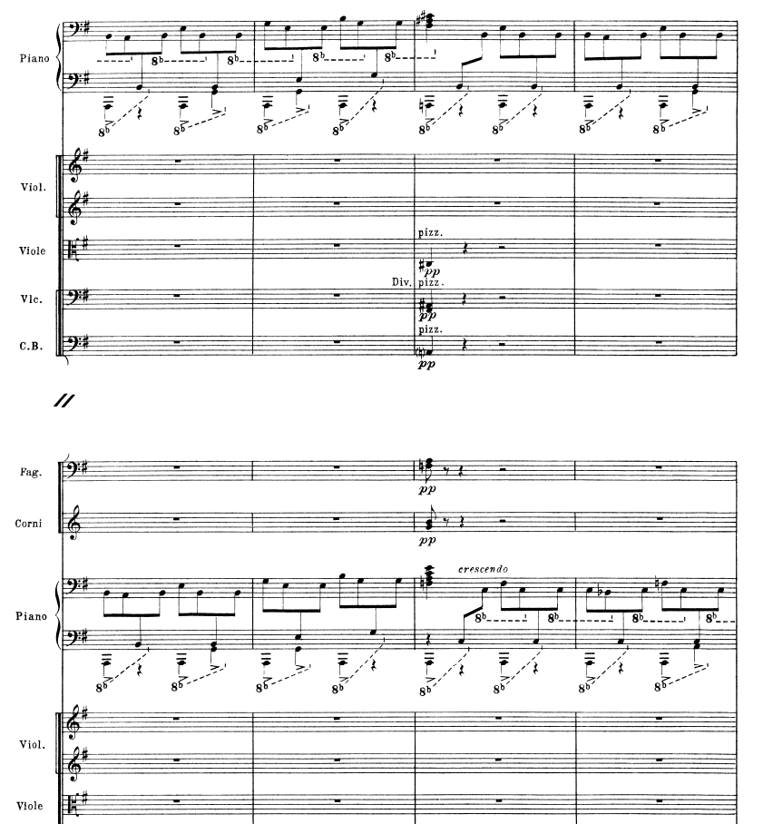

# Ravel
## 1st movement

Opening - really make sure it’s very even. Of course you can show a bit when it goes to the “V” chord and then back, but try to go for consistency in texture. When the chords start, make sure you really know the shape of the chords, since some of them you have to play the white key in between two black ones (like the F# minor)

Main theme - I’m used to rolling the 4th beat (because of Argerich’s recording, lol). But I think more importantly, think of it like a two note slur from D-G to C#-F#. Same as after the oscilatting octave C#'s

https://github.com/user-attachments/assets/6b90058f-d824-46be-bcb3-8e6a354f4bf0

https://github.com/user-attachments/assets/93284ad3-9ece-4026-9bed-af1ed78b74bd

2nd theme, nice. I do think the last part of it can have clearer phrasing.

https://github.com/user-attachments/assets/2a91343c-d778-432f-9413-d7e92d9c861d

Cadenza, can have a bit more timing to allow for the phrasing to happen, just in general. 3rd measure of the cadenza, make sure to change your pedal somewhere so that the F natural doesn’t clash too long with the F# beforehand. The E trill to G trill in the 3rd measure in the right hand should be sort of a shadow or imitation of the melodic E to G in the left hand at the beginning of the measure. 7th Measure of the cadenza, you added an E as the last note of the first group of 16th notes in the left hand (it should jump from C to G). In the second part of the cadenza, the right hand has the melody, and I want you to think of trills as sort of an old-timey singer doing a big vibrato.

https://github.com/user-attachments/assets/23e49808-ad87-4a31-b4b2-ffcc199e31ce

In the big cascade coming down before the 8th note rhythms return (reh. 29), I wouldn’t go full speed - try to keep same tempo, because I think the conductor will have to conduct. Maybe accel through it would be okay, doesn’t have to be strictly in time, but perhaps it goes too fast immediately.

At reh. 29, those chords every 4 measures, make sure they’re long enough that we hear the pitches and the quality of the chord. Just so you know, in the full score, the right hand goes up an octave the second phrase, then back down:

https://github.com/user-attachments/assets/7ddfbd53-95b9-46b0-876e-76c410d5e7fb

Reh. 32 and 33 - no rushing, and maybe you can start adding some pedal, definitely by 33, just for the left hand arp up, and then can be off. I think you really need to feel how the groups of 3 interact with the 2/2 measure. This whole section til the end will be easier if it’s not too fast! I would also bring out a bit more than you are doing the first notes of each group of 4 climbing up to the final G major arpeggios.

2nd movement
I think the crucial thing is to still feel the piece in ¾, not 6/8. With my arm, I actually sort of do 3 2-note slurs. I think otherwise the right hand sounds nice, maybe can have slightly more rubato in some ends of phrases.

https://github.com/user-attachments/assets/f243e61e-5eb7-4e80-9a9f-ed5b605fe691

3rd movement
Tempo is okay, but don’t rush! (Use metronome). In rehearsal 3, make sure the accents are in the correct place, and that you do them (especially the F > toward the end). Reh. 5 - more sparkly sound, less pedal and less legato. Reh. 6, voice the left hand softer so it won’t sound like the two hands are clashing, and when they desynchronize, it won’t be as obvious (though ideally, it shouldn’t desync!).

https://github.com/user-attachments/assets/17291a37-0cb8-440d-aacd-70c602d25309

Reh. 9, left hand make sure it’s placed exactly correct, and also probably need to play it a bit louder (because we naturally play the right hand louder).

https://github.com/user-attachments/assets/52863ac2-12cd-438f-ab40-7acd53d9119c

Between reh 11 and 12, steady! I think the stride bass part also will be easier if you are steady, and voice a bit more to the right hand.
You end on the wrong note! It’s a G, not Eb.

